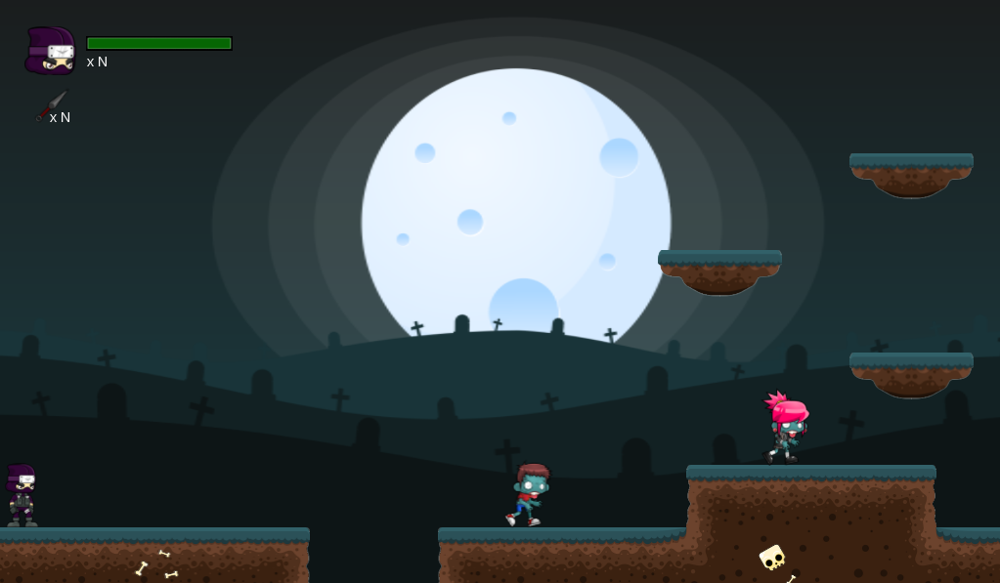

# Qeridien's Revenge

## Description

This is a work from the Mechanics and Balance of Games course.

### About the game

#### History

Qeridien lived in peace, but left his wife to do a major ninja mission. Returning to her house, which was all messed up, she saw only her head on the floor of the room, a zombie head. Anger took hold of his soul and swore to kill all the zombies on the face of the earth.

## Team

 | 
---|---
[Breno Viana](https://github.com/brenov) | [Felipe Barbalho](https://github.com/Barbalho12)
