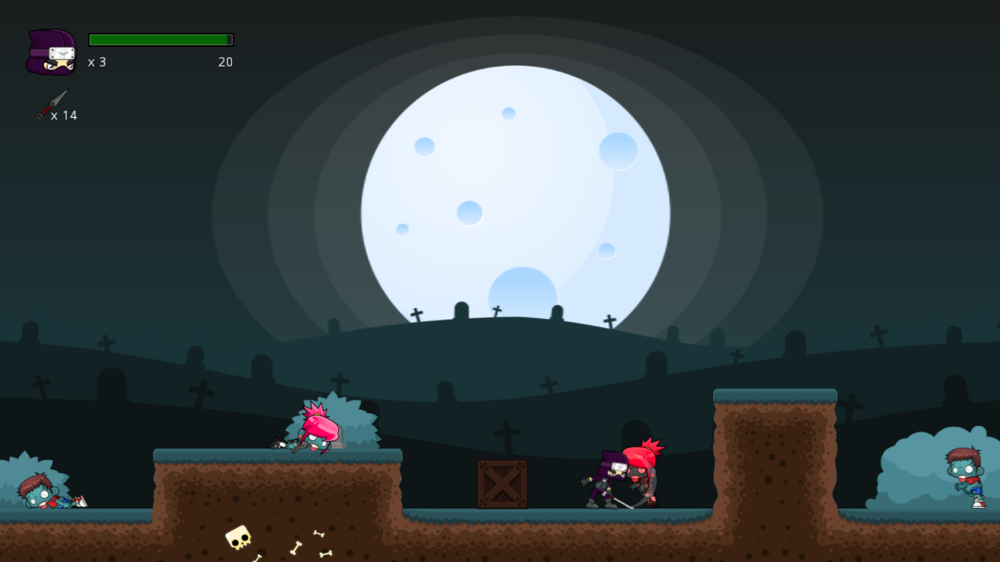
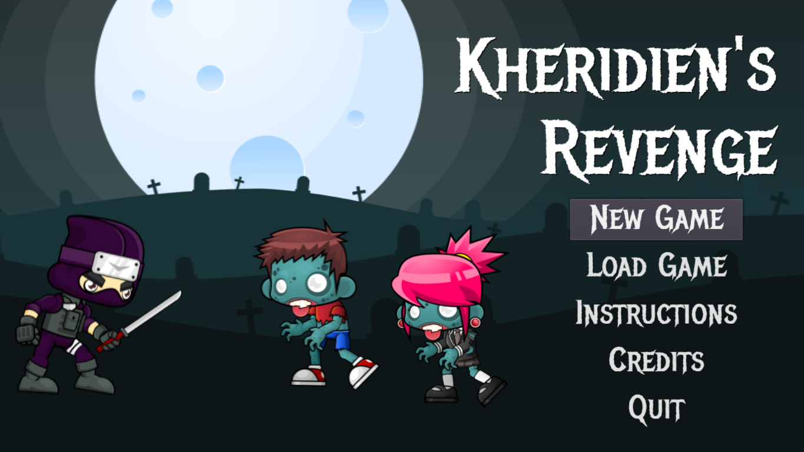
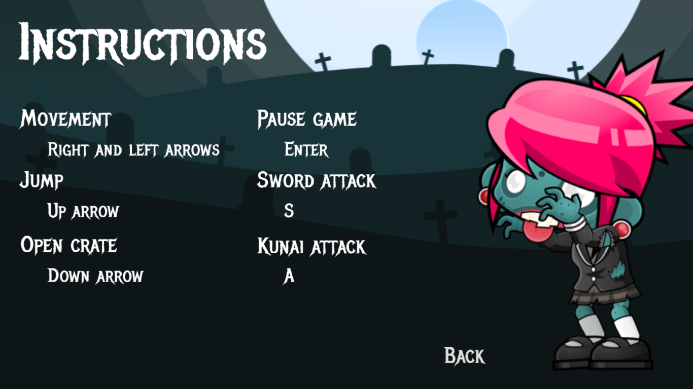
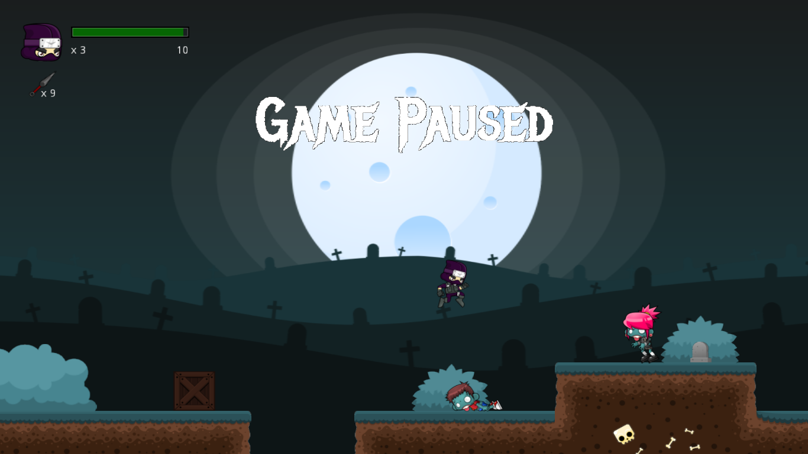
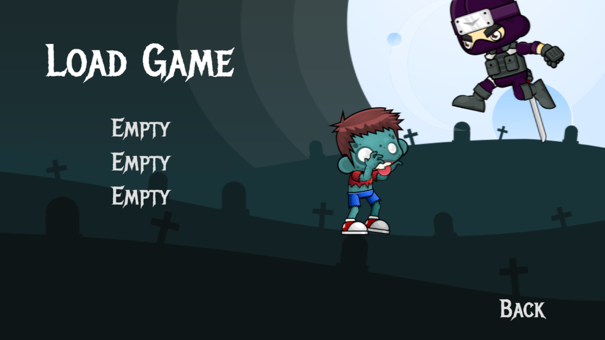
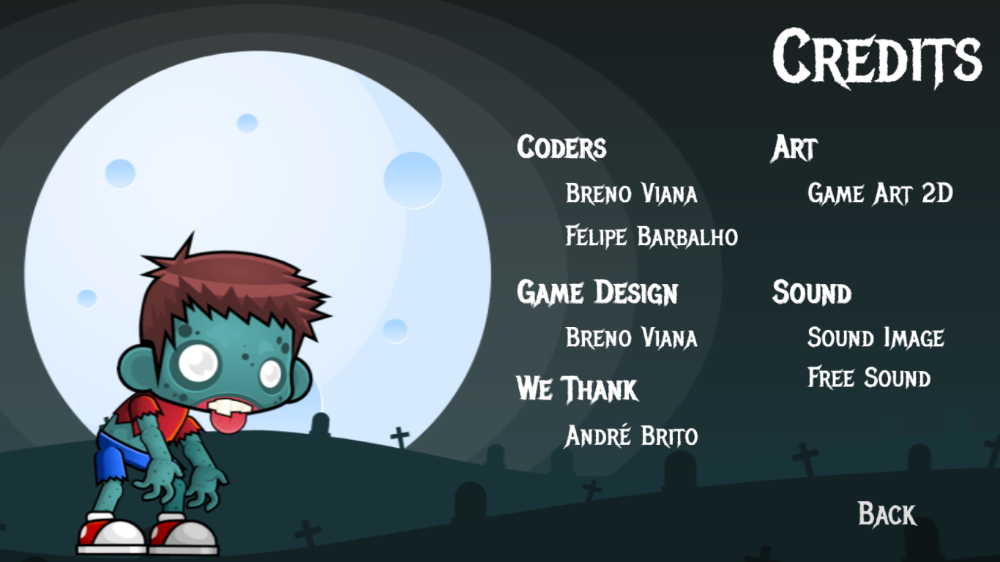

# Kheridien's Revenge 

## Description

Kheridien's Revenge is a game developed for the course of Game Mechanics and Balancing of the Bachelor's program on Information Technology of the Federal University of Rio Grande do Norte (UFRN). Godot, an open-source game engine, and GDScript, the engine's default language, were used for the development of the game. The game, in pre-alpha phase, participated in the EPoGames 2017 gaming festival (local).

The idea of the game arose from free sprites available on the internet, of zombies and a ninja. The game features a ninja, controlled by the player, with the objective to kill all the zombies that goes in their way.

### History

Kheridien received an extremely important and urgent mission. To go complete it, he had to live his wife alone. Days later, after the end of his mission, our protagonist arrives at his house's door and he could smell a rotten body. He walks inside and glimpses his house completely messed up, with blood spoiled all over it. He felt agony and sought for his wife. In the kitchen, he saw his wife had multiple fractures, but she had her head still moving. She became a zombie. So, he took a kunai from his pocket and hit his wife's head, hugging her body afterwards. He wept for hours and, then, Kheridien recovered and ran frlor revenge. His mission was to kill all the zombies on the face of the earth.

## More images

  

    
    
    
    
    
    
  

## Team

 | 
---|---
[Breno Viana](https://github.com/brenov) | [Felipe Barbalho](https://github.com/Barbalho12)
