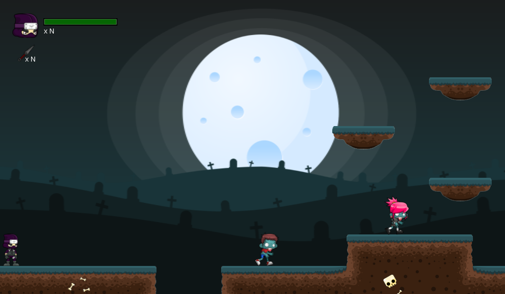

# Kheridien's Revenge

## Description

This is a work from the Mechanics and Balance of Games course.

## Wiki

See more [here](https://github.com/brenov/kheridiens-revenge/wiki).

## Team

 | 
---|---
[Breno Viana](https://github.com/brenov) | [Felipe Barbalho](https://github.com/Barbalho12)
